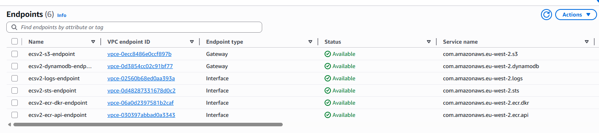
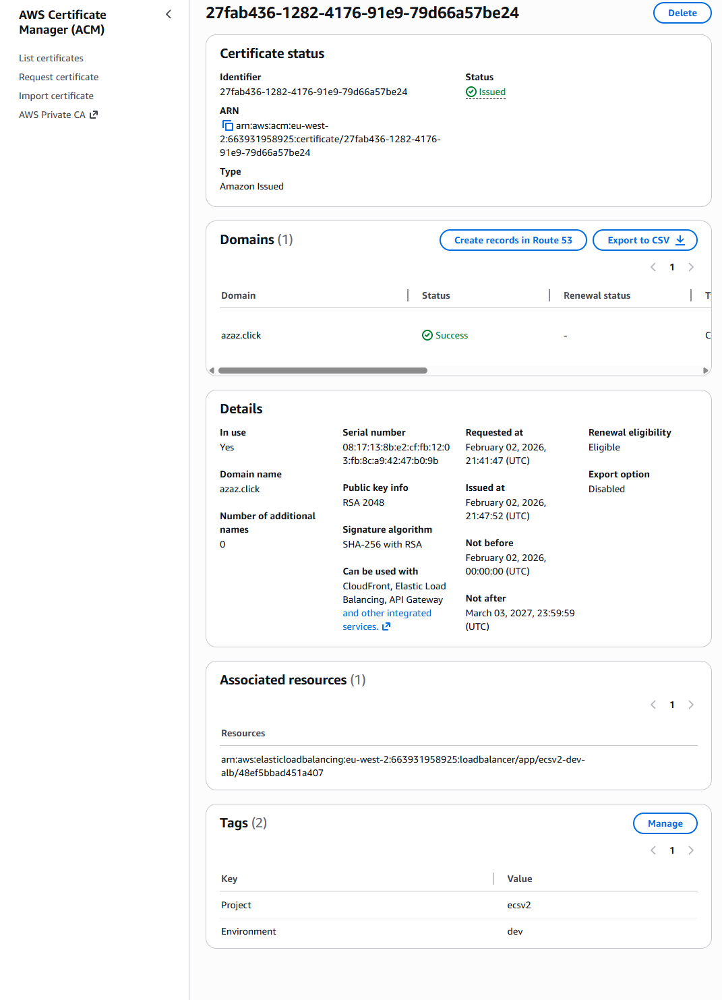
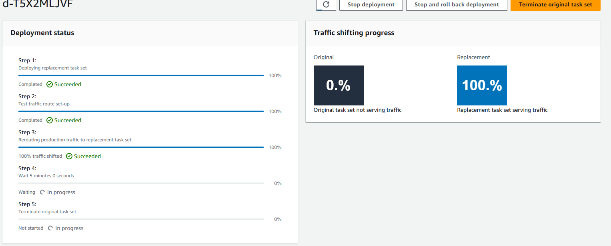
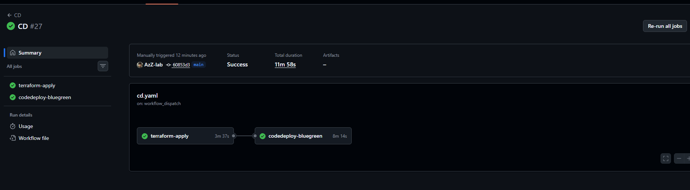
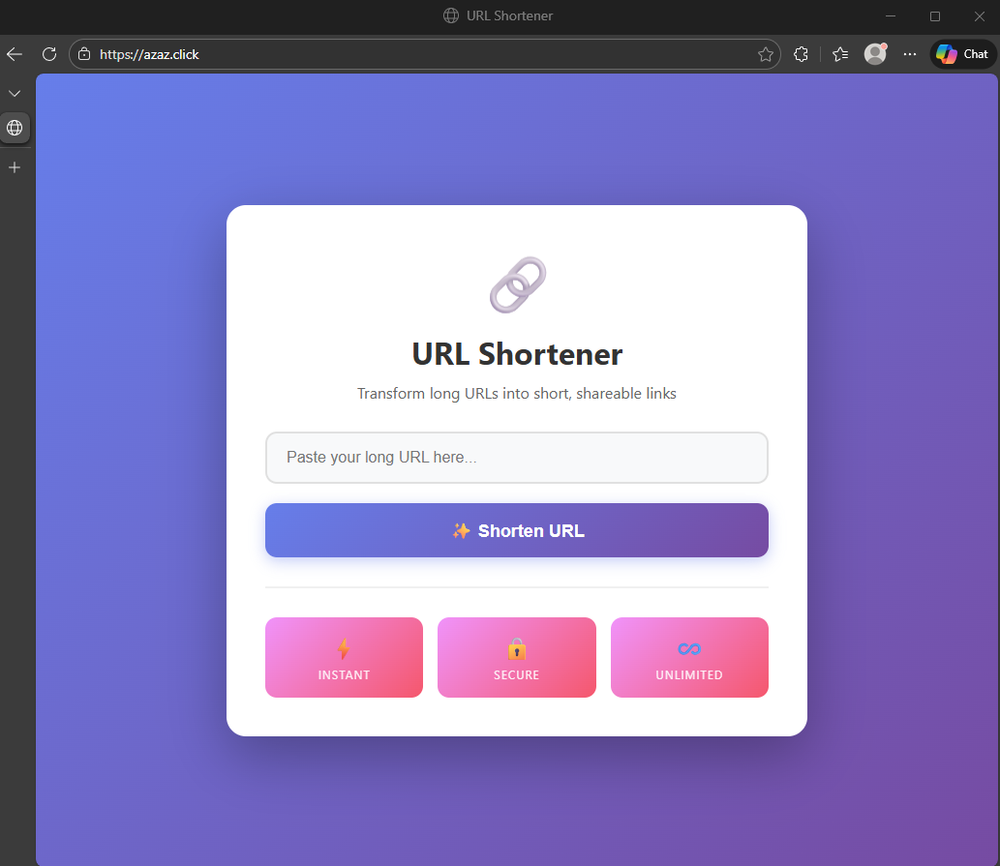

# 🔗 URL Shortener  AWS ECS Fargate

> Production-ready URL shortener running on AWS ECS Fargate. Features zero-downtime blue/green deployments, WAF protection, and fully automated CI/CD, no static credentials, no NAT gateways, no server management.

---

## Table of Contents

- [Quick Start](#quick-start)
- [Tech Stack](#tech-stack)
- [Project Structure](#project-structure)
- [How It Works](#how-it-works)
  - [Traffic Flow](#traffic-flow)
  - [Networking](#networking)
  - [Data Layer](#data-layer)
- [Blue/Green Deployments](#bluegreen-deployments)
- [CI/CD Pipeline](#cicd-pipeline)

---

## Quick Start

```bash
# Clone the repository
git clone https://github.com/your-org/ecs-v2-project.git
cd ecs-v2-project

# Deploy the dev environment
cd Terraform/env/dev && terraform init && terraform apply
```

> CI/CD kicks in automatically on push via GitHub Actions — manual deploys are only needed for the initial bootstrap.

---

## Tech Stack

| Layer | Technology | Why |
|---|---|---|
| Compute | ECS Fargate | No server management, auto-scaling |
| Load Balancing | ALB + AWS WAF | DDoS/injection protection, traffic distribution |
| Storage | DynamoDB (PAY_PER_REQUEST) | Cost-efficient, serverless, PITR enabled |
| Networking | VPC (private subnets only) | No public IPs on tasks, VPC endpoints save ~$64/mo |
| Deployments | AWS CodeDeploy | Blue/green with automatic rollback |
| CI/CD | GitHub Actions + OIDC | No static credentials, fully automated |
| Container Registry | Amazon ECR | Native ECS integration |

---

## Project Structure

```
ECS-V2-Project/
├── .github/                  # GitHub Actions workflows
├── app/
│   ├── src/
│   │   ├── __init__.py
│   │   ├── ddb.py            # DynamoDB interactions
│   │   └── main.py           # FastAPI entrypoint
│   ├── tests/                # Unit tests
│   ├── .gitignore
│   ├── Dockerfile            # Container definition
│   └── requirements.txt      # Python dependencies
│
├── images/                   # README screenshots & diagrams
│
├── Terraform/
│   ├── .terraform/           # Terraform lock & cache (not committed)
│   ├── env/
│   │   └── dev/              # Dev environment entrypoint
│   │       ├── main.tf
│   │       ├── outputs.tf
│   │       ├── provider.tf
│   │       ├── terraform.tfvars
│   │       └── variables.tf
│   ├── modules/
│   │   ├── alb/              # Load balancer + WAF rules
│   │   ├── codedeploy/       # Deployment app & group
│   │   ├── ecs/              # Cluster, service, task definitions
│   │   ├── iam/              # IAM roles & policies
│   │   ├── route53/          # DNS records
│   │   ├── vpc/              # VPC, subnets, VPC endpoints
│   │   └── waf/              # WAF rules
│   ├── .gitignore
│   └── .terraform.lock.hcl
│
└── README.md
```

---

## How It Works

### Traffic Flow


```
Internet
  └─► AWS WAF               # Filters SQL injection, XSS, and common attacks
        └─► ALB              # Distributes across 2 availability zones
              └─► Target Group (Blue or Green)
                    └─► ECS Tasks (FastAPI in private subnets)
                          └─► DynamoDB
```

### Networking

ECS tasks live in **private subnets** with no public IPs. Instead of NAT gateways, the architecture uses **VPC endpoints** to reach AWS services saving roughly $64/month while keeping traffic off the public internet.



Services accessed via VPC endpoints: DynamoDB · ECR · CloudWatch Logs · S3

### Data Layer

- **DynamoDB** stores all URL mappings with `PAY_PER_REQUEST` billing (no idle costs)
- **PITR (Point-in-Time Recovery)** is enabled for data safety
- **CloudWatch Logs** captures all application output centrally

### SSL / TLS



HTTPS is handled via an ACM certificate attached to the ALB — traffic is encrypted end-to-end.

---

## Blue/Green Deployments

Zero-downtime deployments are managed by AWS CodeDeploy. Here's what happens on every deploy:



```
1. New task revision registers to the GREEN target group
   └─► Blue target group continues serving 100% of traffic

2. CodeDeploy runs health checks on the green tasks

3. Traffic shifts from Blue → Green
   └─► Seamless, no dropped requests

4. Old (Blue) tasks stay warm for a configurable period
   └─► Instant rollback available if issues arise

5. Blue tasks drain and terminate
```

**Rollback** is automatic if health checks fail at any stage — no manual intervention needed.

---

## CI/CD Pipeline

Authentication uses **GitHub Actions OIDC** — no AWS access keys stored in GitHub secrets.

### CI — Build, Test & Push


```
Push to main
  └─► ci.yml
        ├── Run unit tests
        ├── Build Docker image
        ├── Scan image for vulnerabilities
        └── Push to ECR
```

### CD — Deploy



```
ECR image pushed
  └─► cd.yml
        ├── terraform apply (infra changes)
        └── Trigger CodeDeploy blue/green deployment
```

### App Running



To tear down all infrastructure:

```bash
# Trigger manually in GitHub Actions
workflow: destroy.yml
```

---
